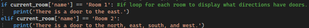
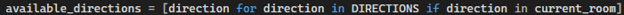
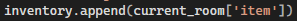
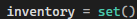
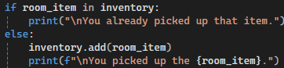
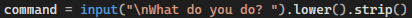

<nav>
  <a href="/">Home</a> |
  <a href="/self-assessment">Professional Self-Assessment</a> |
  <a href="/code-review">Code Review</a> |
  <a href="/projects/text-game">Text-Based Game</a> |
  <a href="/projects/thermostat">Thermostat</a> |
  <a href="/projects/weight-tracker">Weight Tracker</a>
</nav>

---

# Text-Based Adventure Game

## Artifact Overview

This artifact is a Python text-based adventure game called *The Goblin and Its Treasure*. The player explores rooms in a dungeon, collects items, and prepares the defeat the goblin.

## Enhancement Category

Software design and engineering

## Enhancements Made

- Improved input validation
- Refactored repeated logic into reusable functions
- Improved room navigation and item collection
- Used better data structures for inventory management
- Added clearer player feedback and game-ending conditions

## Course Outcomes Demonstrated

- Design, develop, and deliver professional-quality oral, written, and visual communications that are coherent, technically sound, and appropriately adapted to specific audiences and contexts
- Design and evaluate computing solutions that solve a given problem using algorithmic principles and computer science practices and standards appropriate to its solution, while managing the trade-offs involved in design choices
- Demonstrate an ability to use well-founded and innovative techniques, skills, and tools in computing practices for the purpose of implementing computer solutions that deliver value and accomplish industry-specific goals

## Narrative

Enhancing this artifact helped me better understand how important maintainability and readability are in software development. The original version of my text-based game worked, but much of the logic was repetitive and difficult to expand. For example, the original show_status() function used several if/elif statements to manually describe the doors in each room:

 
I improved this by generating available directions dynamically from the room data:

 
This made the code easier to maintain because the room dictionary now controls the available movement options instead of requiring repeated hardcoded statements. A challenge I faced was learning how to reduce repeated logic without making the program harder to read. I learned that good refactoring does not just make code shorter, it makes the design easier to understand and expand.
Another major improvement was changing the inventory from a list to a set. In the original version, the inventory allowed duplicate items:

 
In the enhanced version, I used a set:

 
 
This prevents duplicate items and makes it easier to check whether the player has already collected something.
I also added input normalization:

 
This helped the program handle capitalization and extra spaces more reliably, which improved the user experience.
Overall, I learned that small design choices, such as selecting the right data structure or validating input, can make a program more reliable and professional. The biggest challenge was balancing new features, such as room descriptions and multiple endings, with clean structure. In the end, the artifact became more modular, readable, and scalable while still keeping the original goal of the game intact.

### Downloads

- [Enhanced Source Code](../assets/files/The_Goblin_and_Its_Treasure.py)
- [Original Source Code](../assets/files/Text-Based-Game_ORIGINAL.py)
