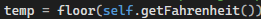
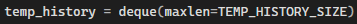
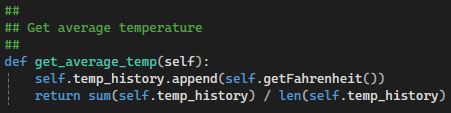
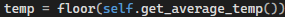
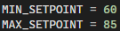

# Raspberry Pi Thermostat

## Artifact Overview

This artifact is a Raspberry Pi thermostat system that uses sensor input, button controls, LED indicators, LCD output, and state-machine logic.

## Enhancement Category

Algorithms and Data Structures

## Enhancements Made

- Improved state-machine organization
- Refined heating, cooling, and off-state logic
- Improved display updates and user feedback
- Strengthened separation of hardware control logic
- Improved maintainability and readability

## Course Outcomes Demonstrated

-

## Narrative

While enhancing this artifact, I learned how relatively small changes to algorithms and data structures can significantly improve the reliability of an embedded system. On of the biggest improvements involved changing how the thermostat handled temperature readings. Originally, the system made heating and cooling decisions based on a single sensor reading:

 
This worked, but it made the thermostat sensitive to momentary fluctuations in temperature. To improve stability, I implemented a deque data structure to store the last ten readings and created a new averaging algorithm:

 
I then updated the code to use the average temperature instead:

 
This change made the thermostat respond more consistently and taught me how appropriate data structures can improve algorithm performance and reliability.
Another enhancement involved adding input validation to prevent unrealistic setpoint values. Originally, the buttons simply increased or decreased the temperature indefinitely. I modified the code to enforce minimum and maximum values:

 
This change improved the robustness of the system and reinforced the importance of defensive programming practices. 
During the enhancement process, I also discovered several issues in the original code. Once bug occurred when exiting the heating state:

 
Because the method was missing parentheses, it was never actually called. I also found that the heating and cooling decision logic inside updateLights() was incorrectly indented beneath the debug statements. Moving the logic outside the debug block ensured that the LEDs behaved correctly regardless of whether debugging was enabled. 
One of the biggest challenges I faced was integrating these enhancements into the existing state machine while preserving the functionality of the display updates, serial communication, and LED controls. Through testing and debugging, I learned the importance of making incremental changes and carefully evaluating how one modification can affect other components of the system. Overall, this enhancement strengthened my understanding of algorithms, data structures, debugging, and software design while demonstrating how thoughtful improvements can make a system more reliable and maintainable. 
