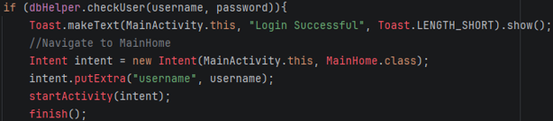
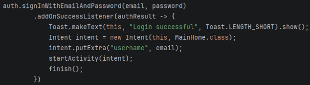
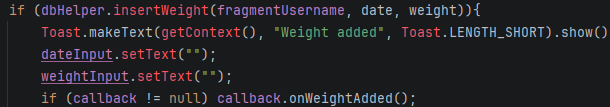
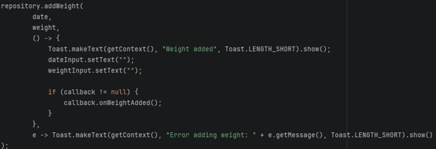
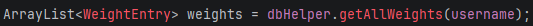
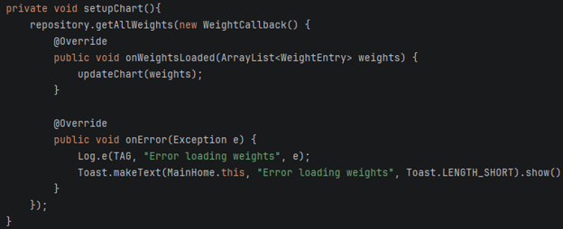
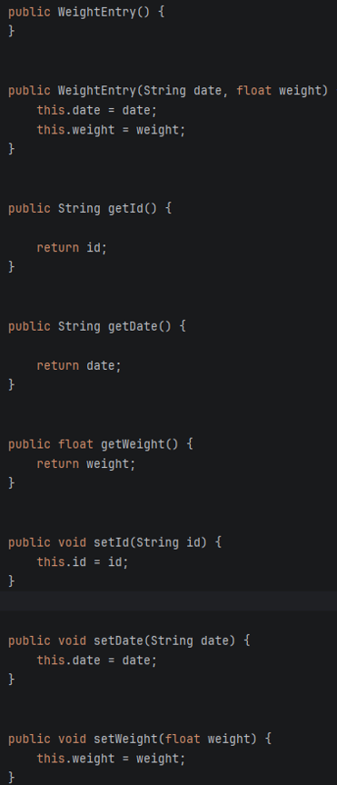

<nav>
  <a href="/">Home</a> |
  <a href="/self-assessment">Professional Self-Assessment</a> |
  <a href="/code-review">Code Review</a> |
  <a href="/projects/text-game">Text-Based Game</a> |
  <a href="/projects/thermostat">Thermostat</a> |
  <a href="/projects/weight-tracker">Weight Tracker</a>
</nav>

---

# Weight Tracking Application

## Artifact Overview

This artifact is an Android weight tracking application developed in Java. The app allows users to record and manage weight entries.

## Enhancement Category

Databases

## Enhancements Made

- Added Firebase database integration
- Improved data persistence
- Organized app logic more clearly
- Improved user data handling
- Strengthened the applications structure for future expansion

## Course Outcomes Demonstrated

- Employ strategies for building collaborative environments that enable diverse audiences to support organizational decision making in the field of computer science
- Design, develop, and deliver professional-quality oral, written, and visual communications that are coherent, technically sound, and appropriately adapted to specific audiences and contexts
- Design and evaluate computing solutions that solve a given problem using algorithmic principles and computer science practices and standards appropriate to its solution, while managing the trade-offs involved in design choices
- Demonstrate an ability to use well-founded and innovative techniques, skills, and tools in computing practices for the purpose of implementing computer solutions that deliver value and accomplish industry-specific goals
- Develop a security mindset that anticipates adversarial exploits in software architecture and designs to expose potential vulnerabilities, mitigate design flaws, and ensure privacy and enhanced security of data and resources

## Narrative

During the enhancement, I learned how important it is to separate application logic from data storage logic. In the original version, the app depended on a SQLite helper to manage user accounts, weight entries, and goals. For example, MainActivity used a local DBHelper class to insert users and check login credentials while WeightDatabaseHelper handles weight entries and goals locally. As I enhanced the project, I learned that using Firebase requires a different structure because Firestore works asynchronously and stores data in cloud collections rather than local tables. This helped me improve the design by moving database operations into a Firebase repository class instead of keeping database calls spread across the activities and fragments. 
One major change was replacing the local login storage with Firebase Authentication. Originally, the app checked users like this: 

 
After the enhancement, the login process changed to Firebase Authentication:

 
This change improved security because the app no longer needed to store usernames and passwords directly in a local table. 
Another important change was replacing the local weight storage with Firestore. Originally, the app inserted a new weight entry like this:

 
In the enhanced version, the fragment calls a Firebase repository instead:

 
This taught me how asynchronous programming changed the flow of an android application. With SQLite, the app immediately receives a result. With Firebase, the app has to wait for success or failure callbacks. That was one of the biggest challenges because the charts, fragments, and goal screen all needed to update only after Firebase finished loading or saving data. 
The chart logic also changed. In the original MainHome, the chart loaded weights directly from SQLite: 

 
After the enhancement, the chart loads data asynchronously from Firestore:

 
This improved the design because MainHome no longer needs to know exactly how the data is stored. It only asks the repository for the data and then updates the chart. I also had to update WeightEntry to include an empty constructor, getters, and setters that are required for Firestore:

 
The biggest challenges were understanding Firebases asynchronous callbacks, deciding how to structure Firestore collections, and replacing local database logic without breaking the existing UI. I also had to think more carefully about security, especially because the original login system stored passwords locally. Overall, this enhancement helped me learn how to modernize an Android application by moving from local storage to cloud storage, improving maintainability, scalability, and security while keeping the app’s core purpose the same. 

### Downloads

- [Enhanced Source Code](../assets/files/Weight_Tracker_Enhanced.zip)
- [Original Source Code](../assets/files/WeightTracker_ORIGINAL.zip)
